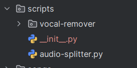

# Setup
It's necessary to install python dependencies before running the app. Please do it in virtual env ".venv", you need to use python 3.10 as the newer versions don't work with the vocal-remover library.
```
karaoke/backend$ python3.10 -m venv .venv
karaoke/backend$  source .venv/bin/activate
(.venv)  karaoke/backend$ pip install -r requirements.txt
```
If you don't want to use venv or want to call it a different name, change the python.interpreter.command property in application.properties:
```
python.interpreter.command=source ./.venv/bin/activate && python3.10
```

You should also download the vocal remover and place it in scripts directory (https://github.com/tsurumeso/vocal-remover/releases/download/v5.1.1/vocal-remover-v5.1.1.zip):

