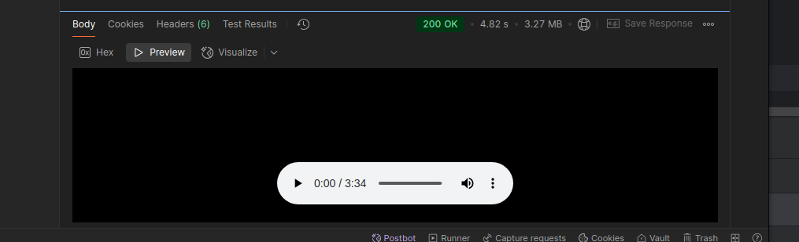

# Setup

It's necessary to install python dependencies before running the app. It's best to do it in virtual env. 
You need to use python 3.10 as the newer versions don't work with the vocal-remover library.

```
karaoke/backend$ python3.10 -m venv .venv
karaoke/backend$  source .venv/bin/activate
(.venv)  karaoke/backend$ pip install -r requirements.txt
```

You should also download the vocal remover and place it in scripts
directory (https://github.com/tsurumeso/vocal-remover/releases/download/v5.1.1/vocal-remover-v5.1.1.zip):


# Usage
## Song transcription
```
curl -X POST \
   http://localhost:8080/api/audio/transcribe?youtubeUrl={youtubeUrl}
```

Example:
```
curl -X POST \
   http://localhost:8080/api/audio/transcribe?youtubeUrl=https://www.youtube.com/watch?v=dQw4w9WgXcQ
```
Response:
```json
{
    "full_text": " Niech nie dałeś znać, niech powiedziałeś słowa...",
    "segments": [
        {
            "end": 5.0,
            "start": 0.0,
            "text": " Niech nie dałeś znać, niech powiedziałeś słowa"
        },
        {
            "end": 10.0,
            "start": 5.0,
            "text": " Mógłeś tu obok wyjdzie, czule, nie zachować"
        },
        {
            "end": 16.0,
            "start": 10.0,
            "text": " Niech nie zachować, to niech nie chcesz"
        }
    ]
}
```
## Remove vocal
The following endpoint removes vocal from the audio downloaded from given 
in request param and saves the vocal and instrumental parts in the server's filesystem.
Then it returns paths for the vocal and instrumental parts
```
curl -X POST \
   http://localhost:8080/api/audio/split?youtubeUrl={youtubeUrl}
```


Example:
```
curl -X POST \
   http://localhost:8080/api/audio/split?youtubeUrl=https://www.youtube.com/watch?v=dQw4w9WgXcQ
```
Response:
```json
{
    "instrumentsPath": "/api/audio/split/fil7T3YMaqs/fil7T3YMaqs_Instruments.mp3",
    "vocalsPath": "/api/audio/split/fil7T3YMaqs/fil7T3YMaqs_Vocals.mp3"
}
```
To get the desired splitted audio files, use the GET endpoint:
```
curl -X GET \
    http://localhost:8080/{pathFromPreviousPostRequest}
```

Example:
```
curl -X GET \
    http://localhost:8080/api/audio/split/fil7T3YMaqs/fil7T3YMaqs_Instruments.mp3
```
Response, example when running in Postman:   

